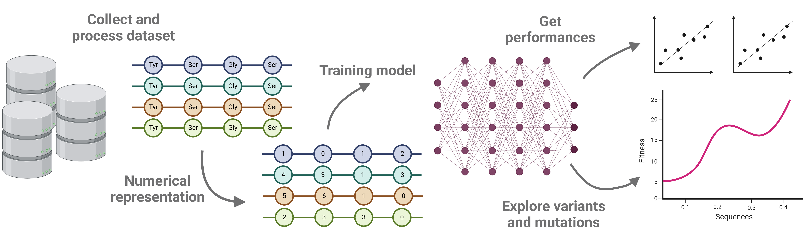

# Demo library for train predictive models in protein engineering and bioinformatic tasks

This repository facilitates the training of predictive models for protein engineering and bioinformatic tasks.

Specifically, the repository has implemented different modules and jupyter notebooks to preparing, encoding, training, and use predictive models.

## A traditional pipeline to develop predictive models using sequence-based approaches

The next figure demonstrates a brief simple pipeline to develop predictive models using machine learning and protein sequences as input.



The process starts with a data collection, then the data is processed and numerical representation strategies need to be applied to represent the sequences for training process. Then, a machine learning model is trained. Traditionally, the dataset is divided into training, validation, and testing. The training dataset is used to fit the hyperparameters of the model, validation and testing datasets are used to evaluate the performances of the model. Alternative methods included the use of cross validation to prevent overfitting in the case of low-N regime datasets.

## Demo datasets

This repository has two demonstrative datasets:

1. **Antimicrobial peptides**: This dataset facilitates the identification of peptides with the antimicrobial activity and peptides without the antimicrobial activity. This dataset is already prepared (see Folder [antimicrobial](raw_data/Antimicrobial/)). The preparation of the dataset implied the discrepance reduction, homology redundancy deletion, and split the data into training, validation, and testing dataset.

2. **Protein solubility**: This dataset contains information about the solubility of the protein sequences (in percentage). Moreover, this dataset has been preprocessed removing inconsistences and redundancy. In this case, the redundancy was removed by applying CD-Hit on range of the data by quantiles. Besides, the data was divided using the notebook [demo_split_data.ipynb](notebooks/demo_split_data.ipynb). 

## Source code and implementation strategies

The source code is implemented using modules. The folder [src](src/) contain all the source code associated with the use of the developed strategies. Currently, the following methods are available:

- Embedding extraction
- Encoder methods
- Feature description
- Training models

The utils module facilitates the implementation of misc tasks.

## Working with the library

Before to start, please clone this repository, access to cloned repo and use the environment file to produce prepare the environment. Please, use the following command line:

```
conda env create -f environment.yml
```
## Examples

In the folder [notebooks](notebooks/) you will find different notebooks to demonstrate how to use the library. Moreover, in the folder [testing](testing/) you will find different scripts to run the embedding extraction. In this case, only the last layer of the embedding is processed.

Usually, different pipelines can be applied concerning the task. For example:

1. You can process your data, apply embedding extraction, and then see the generated data with dimensionality reduction approaches. At the same time, you can use the embedding to train ML models.

2. With feature-engineering, you can make some statisticall analysis of the processed data to compare to groups based on feature-distributions.

3. With the encoder and embedding-extraction methods, you can apply some clustering strategies (Coming soon)

## Coming soon

- Runing scripts
- Clustering strategies
- Fine tuning for regression models
- Alternative strategies to develop predictive models